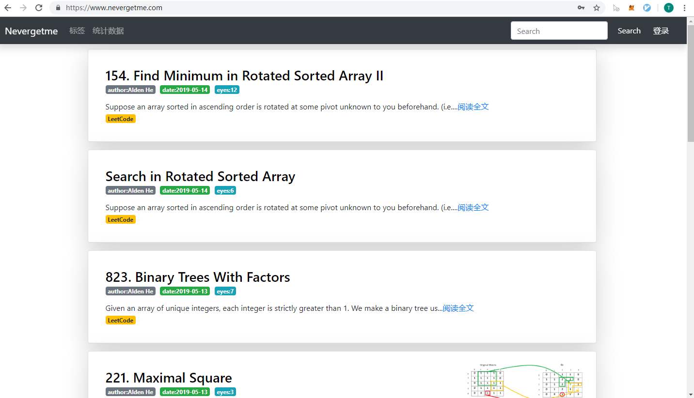
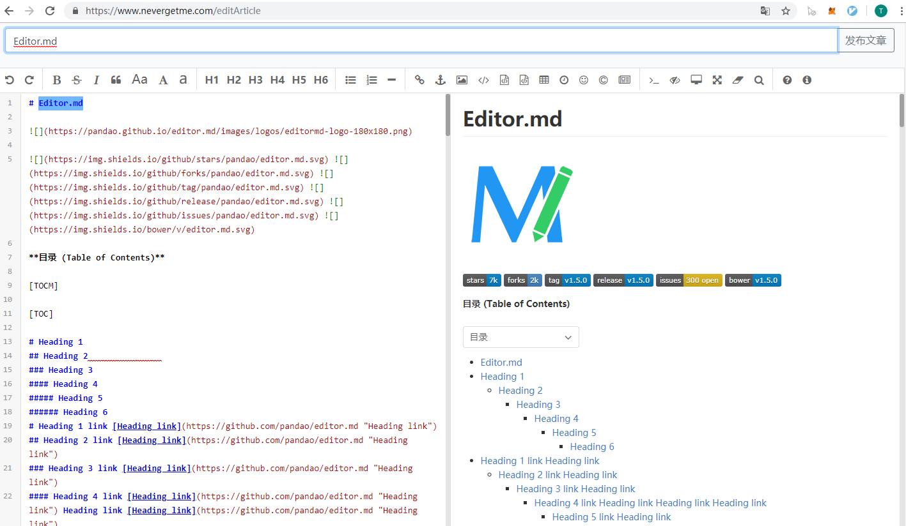
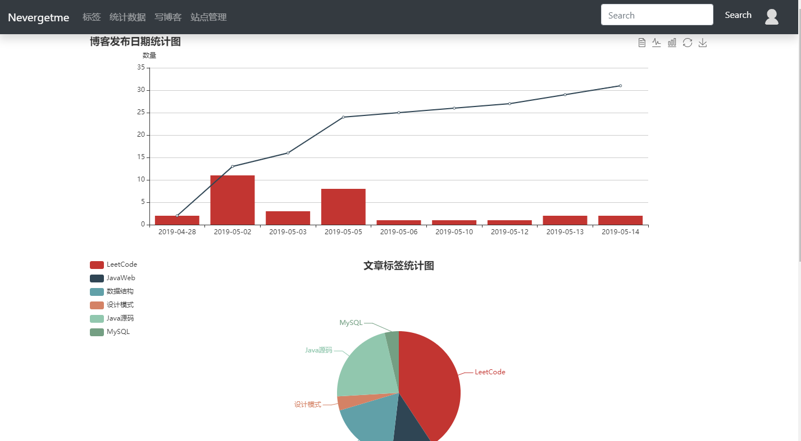
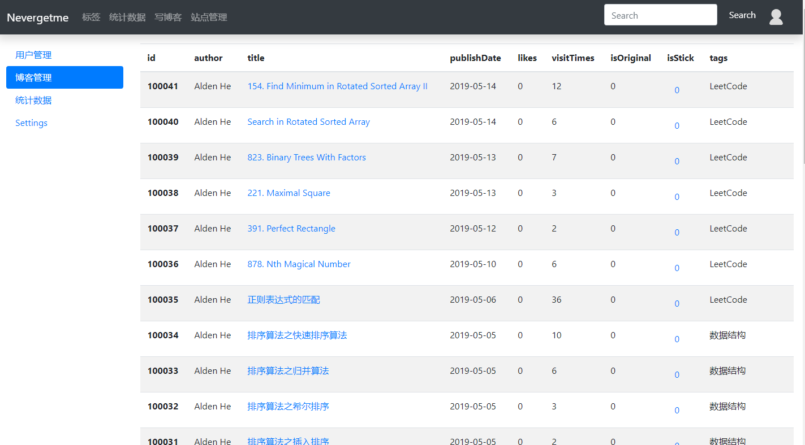
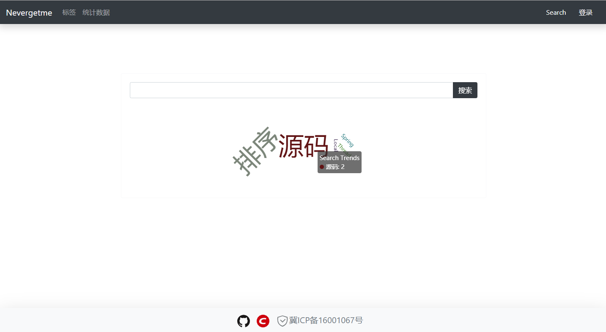

# NeverGetMeWeb
博客主页[https://www.nevergetme.com/](https://www.nevergetme.com/)

__博客采用的技术__：

 1. Web框架：Springboot
 2. 数据库ORM：[MyBatis](https://blog.mybatis.org/)
 3. 分页插件：[PageHelper](https://pagehelper.github.io/)
 4. 数据库：MySQL
 5. 缓存：[Redis](https://redis.io/)
 6. 前端模板：[Thymeleaf](https://www.thymeleaf.org/)
 7. 前端：[Bootstrap](https://getbootstrap.com/)
 8. 文章编辑与展示：[Editor.md](https://pandao.github.io/editor.md/examples/full.html)
 9. 数据展示：[echarts](https://echarts.baidu.com/)
 10. 项目构建：Maven
 11. 项目部署：Docker
 12. 鉴权：~~Spring Security(Disabled)~~
 13. [词云图](https://github.com/ecomfe/echarts-wordcloud)
 14. [Image Viewer](https://github.com/fengyuanchen/jquery-viewer)
 
__使用的服务器__: 阿里云的学生服务器，1核2G内存1M带宽

__目前实现的功能__：

* 用户邮箱注册
* 博客列表展示
* 按照标签分类
* 查看统计数据
* 简单后台管理
* markdown语法编辑博客
* 搜索记录词云图展示

__部署方式__:使用Maven打包成jar然后通过Docker部署

Dockerfile
```
FROM java:8
MAINTAINER hzw
ADD app.jar /home/app.jar
ENTRYPOINT ["java","-jar","/home/app.jar"]
```
run.sh
```
#!/bin/bash
rm app.jar
mv never*.jar app.jar
docker stop myapps
docker rm myapps
docker build -t wisely/myapps .
docker run -d --name myapps -v /home/image:/home/img -p 8080:8080 wisely/myapps 
```
通过rz命令将jar文件复制到该文件夹，然后通过执行 run.sh即可完成部署
* 需要给run.sh执行权限
* mv never*.jar app.jar 按需更改

## 页面展示
* 首页
  
* 文章编辑界面
  
* 统计界面
  
* 后台管理界面
  
* 搜索界面
  
## MySQL建表
* 用户表
```sql
CREATE TABLE `user` (
  `id` int(11) NOT NULL AUTO_INCREMENT,
  `user_uuid` varchar(70) DEFAULT NULL,
  `username` varchar(255) DEFAULT NULL,
  `password` varchar(255) DEFAULT NULL,
  `email` varchar(255) DEFAULT NULL,
  `telephone` varchar(255) DEFAULT NULL,
  `role` int(10) DEFAULT NULL,
  `image` varchar(255) DEFAULT NULL,
  `last_ip` varchar(255) DEFAULT NULL,
  `last_time` varchar(255) DEFAULT NULL,
  PRIMARY KEY (`id`) USING BTREE
) ENGINE=InnoDB AUTO_INCREMENT=10005 DEFAULT CHARSET=utf8 ROW_FORMAT=COMPACT
```
__role为10时表示用户是管理员，可以发表文章，查看管理界面，进行管理操作等__

* 文章表
```sql
CREATE TABLE `article` (
  `id` int(11) NOT NULL AUTO_INCREMENT,
  `authorId` int(11) NOT NULL,
  `title` varchar(255) NOT NULL,
  `content` longtext NOT NULL,
  `publishDate` timestamp NOT NULL DEFAULT CURRENT_TIMESTAMP,
  `updateDate` timestamp NOT NULL DEFAULT CURRENT_TIMESTAMP ON UPDATE CURRENT_TIMESTAMP,
  `likes` int(11) NOT NULL DEFAULT '0',
  `shortcut` varchar(255) DEFAULT NULL,
  `visitTimes` int(11) NOT NULL DEFAULT '0',
  `isOriginal` int(1) NOT NULL DEFAULT '0',
  `isStick` tinyint(1) NOT NULL DEFAULT '0',
  `cover` varchar(100) DEFAULT NULL,
  PRIMARY KEY (`id`)
) ENGINE=InnoDB AUTO_INCREMENT=100042 DEFAULT CHARSET=utf8
```
* 评论表
```sql
CREATE TABLE `ArticleComments` (
  `id` int(11) NOT NULL AUTO_INCREMENT,
  `commentUserId` int(11) NOT NULL,
  `articleId` int(11) NOT NULL,
  `content` varchar(400) NOT NULL,
  `createTime` timestamp NOT NULL DEFAULT CURRENT_TIMESTAMP,
  PRIMARY KEY (`id`)
) ENGINE=InnoDB AUTO_INCREMENT=7 DEFAULT CHARSET=utf8
```
* 回复表
```sql
CREATE TABLE `ReplyComment` (
  `id` int(11) NOT NULL AUTO_INCREMENT,
  `articleId` int(11) NOT NULL,
  `commentId` int(11) NOT NULL,
  `replyUserId` int(11) NOT NULL,
  `repliedUserId` int(11) NOT NULL,
  `content` varchar(200) NOT NULL,
  `createTime` timestamp NOT NULL DEFAULT CURRENT_TIMESTAMP,
  PRIMARY KEY (`id`)
) ENGINE=InnoDB AUTO_INCREMENT=100001 DEFAULT CHARSET=utf8
```
* 标签表
```sql
CREATE TABLE `tags` (
  `id` int(11) NOT NULL AUTO_INCREMENT,
  `value` varchar(100) NOT NULL,
  PRIMARY KEY (`id`)
) ENGINE=InnoDB AUTO_INCREMENT=10006 DEFAULT CHARSET=utf8
```
* 文章标签表
```sql
CREATE TABLE `articleTags` (
  `id` int(11) NOT NULL AUTO_INCREMENT,
  `tagid` int(11) NOT NULL,
  `articleid` int(11) NOT NULL,
  PRIMARY KEY (`id`)
) ENGINE=InnoDB AUTO_INCREMENT=44 DEFAULT CHARSET=utf8
```
* 访问记录表
```sql
CREATE TABLE `PageView` (
  `id` int(10) NOT NULL AUTO_INCREMENT,
  `visitTime` date NOT NULL,
  `pv` int(11) NOT NULL,
  PRIMARY KEY (`id`),
  UNIQUE KEY `visitTime` (`visitTime`)
) ENGINE=InnoDB AUTO_INCREMENT=36 DEFAULT CHARSET=latin1
```
* 搜索记录表
```sql
CREATE TABLE `searchhistory` (
  `id` int(11) NOT NULL AUTO_INCREMENT,
  `content` varchar(200) NOT NULL,
  `times` int(11) NOT NULL DEFAULT '1',
  PRIMARY KEY (`id`),
  UNIQUE KEY `content` (`content`)
) ENGINE=InnoDB DEFAULT CHARSET=utf8
```
* 系统通知表
```sql
CREATE TABLE `SystemMessage` (
  `id` int(11) NOT NULL AUTO_INCREMENT,
  `receiver` int(11) NOT NULL,
  `content` varchar(255) NOT NULL,
  `sendState` tinyint(1) NOT NULL,
  `readState` tinyint(1) NOT NULL,
  `createTime` timestamp NOT NULL DEFAULT CURRENT_TIMESTAMP,
  `type` int(2) NOT NULL,
  `url` int(11) NOT NULL DEFAULT '0',
  `sender` int(11) NOT NULL,
  PRIMARY KEY (`id`)
) ENGINE=InnoDB AUTO_INCREMENT=5 DEFAULT CHARSET=utf8
```

## 项目目录
- java
  - bean
    - Article
    - ArticleComment
    - PublishDateStatistical
    - ReplyComment
    - Tags
    - User
    - Visitor
  - config
    - RedisWebSecurityConfig：拦截器
    - StaticConfigParam：静态参数
  - controller
    - MainController：返回Thymeleaf的模板控制类
  - interceptor
    - RedisSessionInterceptor：控制其他权限
    - RedisSessionRoleInterceptor：控制管理员权限
  - mapper
    - ArticleCommentMapper
    - ArticleMapper
    - ReplyCommentMapper
    - StatisticsMapper
    - UserMapper
  - restcontroller：处理post，get请求，返回json数据
    - AdminRestController
    - ArticleRestController
    - CommentRestController
    - UserRestController
  - service
    - impl
      - ArticleCommentServiceImpl
      - ArticleServiceImpl
      - ReplyCommentServiceImpl
      - SendEmailServiceImpl
      - StatisticsServiceImpl
      - UserServiceImpl
    - ArticleCommentService
    - ArticleService
    - ReplyCommentService
    - SendEmailService
    - StatisticsService
    - UserService
  - utility
    - ContentUtility:一些静态函数
- resources
  - mapper: MyBatis的Mapper
    - ArticleCommentMapper.xml
    - ArticlesMapper.xml
    - ReplyCommentMapper.xml
    - StatisticsMapper.xml
    - UserMapper.xml
  - static: 静态文件
  - templates: Thymeleaf模板
  - application.properties:公共properties，包含了Email的相关参数
  - application-dev.properties:测试环境
  - application-prod.properties:生产环境

## 已知BUG
* 词云图如果词汇变大会放不下,官方解释如下
  > The current implementation will skip the word that can't be fit into the canvas. This is a faulty design and should be corrected. It can be fixed by laying out the words on a boundless virtual canvas, and scale the entire virtual canvas until it fits into the visual canvas. The project, however, is not trivial.


## 更新2019-05-15
* 需要增加通过标签读取文章的功能

## 更新 2019-05-07
* 新增了评论功能

## 更新 2019-05-03
* 新增了注册界面
* 能够通过邮箱注册

## 更新 2019-05-02
* 更改了container样式，能够显示阴影
* 更改了header和footer的颜色
* 增加了标签内容
* 修改了博文其他信息的显示方式
* 修复了不能够连续ctrl+v上传图片的bug
* 可用通过https访问网站

## 更新2019-05-01
* 去掉Spring Security，使用HttpSession
## 更新2019-04-30
* 将head和footer分离
* 引入redis缓存：
  * 缓存每一篇文章，首先从缓存中读取，如果缓存中没有
  * 则从数据库中读取并加入缓存
  * 如果新建文章，则更新缓存
* 使用docker部署

## 更新 2019-04-29
* 增加了已读数功能
* 增加了页脚footer
* 如果当前文章数少于5则将页脚固定在页面底部，大于等于5固定在容器底部
* 增加了一些新的图标：日期，喜欢，阅读数
* 更改了文章的排序方法，安装id倒序
* 增加了分页插件
* 增加了Ctrl+V上传图片功能
* 增加Spring Security认证


